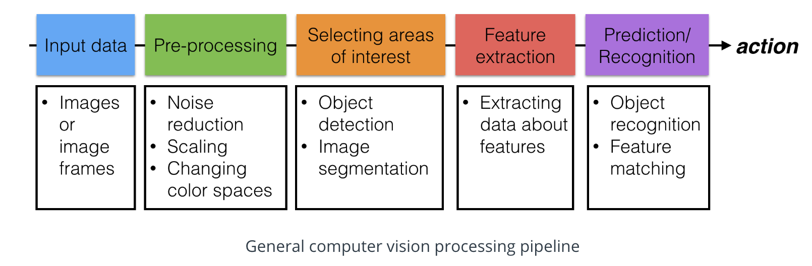
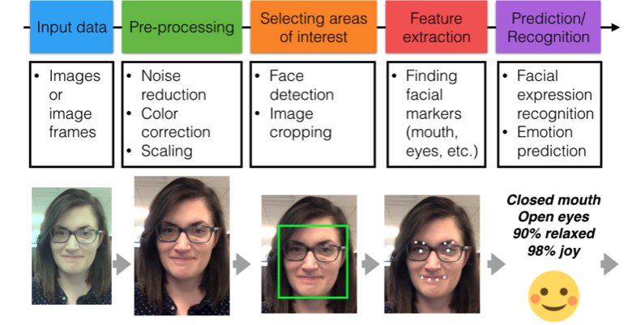
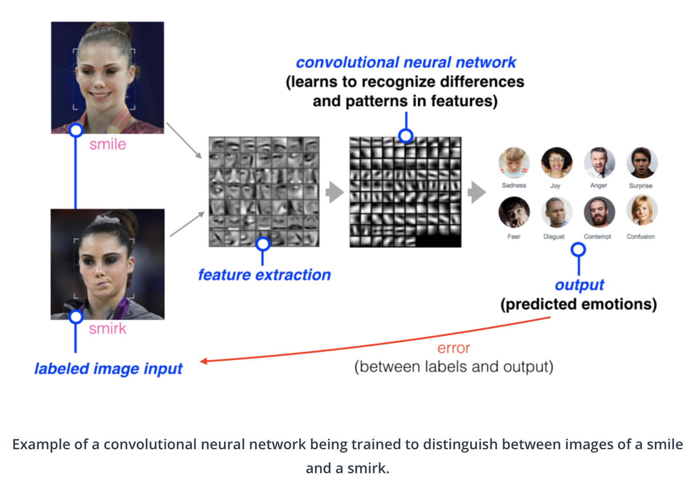
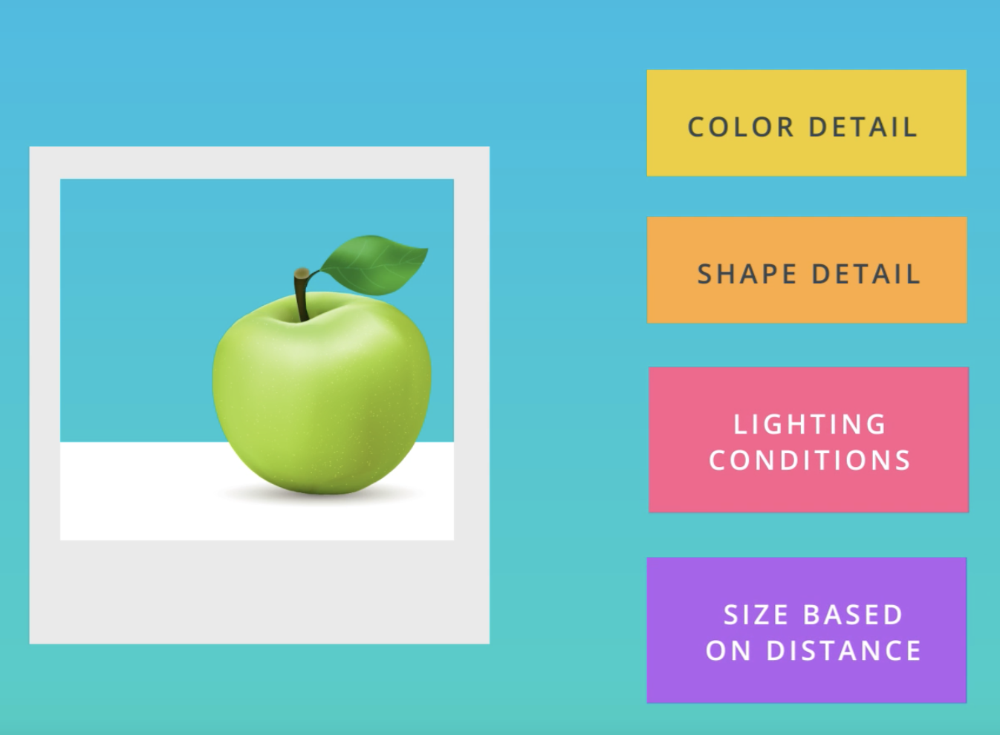
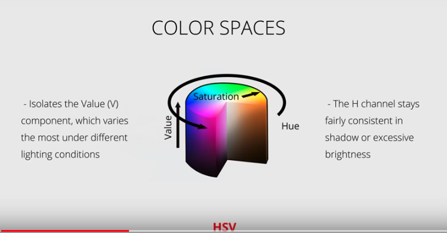

#### Notes

2. **Emotional and Cognitive intelligence**
  - Cognitive intelligence: is the ability to reason and understand the world based on observations and facts
  - Emotional intelligence: is the ability to understand and influence human emotion (*Affectiva* works on emotional AI)

3. **Computer Vision Pipeline**
- A general categorization of steps that one might take for any Computer Vision problem

4. **Training a model**

6. **AffdexMe Demo**

7. **Image formation**

8. **Image as pixels**  
- Treating images as grids of numbers is the basis for many image processing techniques.

9. **Color Images**
- Color images are interpreted as 3D cubes of values with width, height, and depth (number of color channels)
- If the identification problem is easier in color for us humans, it’s likely easier for an algorithm to see color images too!

10. **Color Threshold**
- OpenCV reads in images in BGR format (instead of RGB) because when OpenCV was first being developed, BGR color format was popular among camera manufacturers and image software providers

11. **Color Space and Transforms**
- HSV is more valuable and effective in selecting the colorspace under varying light condition

- Hue remains fairly consistent under varying light condition
- Value is the best component to use to study te varying brightness conditions
- *Color Picker* : https://www.w3schools.com/colors/colors_picker.asp

12. **Day and night classification**
- **Feature** : A feature is a measurable component of an image or object that is, ideally, unique and recognizable under varying conditions - like under varying light or camera angle.
- Steps
  - Load and Check the data
  - Divide the data into training and test datasets
  - Select and come up with the traits that you can use as features to carry out the Classification
  - Pre-process and standardize the training/test datasets

- There are 2-types of encoding for the categorical dataset
  - Integer encoding : assign each category value an integer value. So, day = 1 and night = 0. This is a nice way to separate binary data, and it's what we'll do for our day and night images

  - One-hot encoding : One-hot encoding is often used when there are more than 2 values to separate. A one-hot label is a 1D list that's the length of the number of classes.

- Basic standardisation steps:
  - Make all images size same
  - convert the labels to numerical encoding
