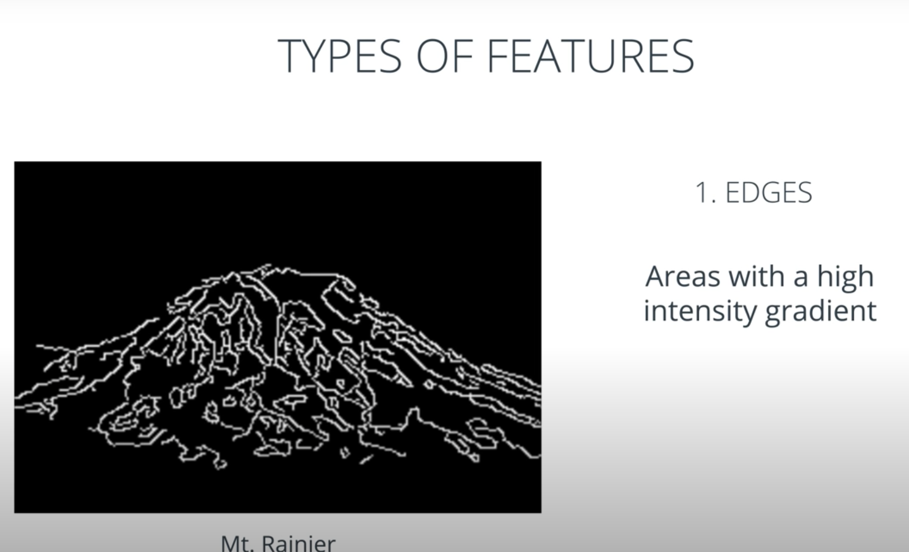
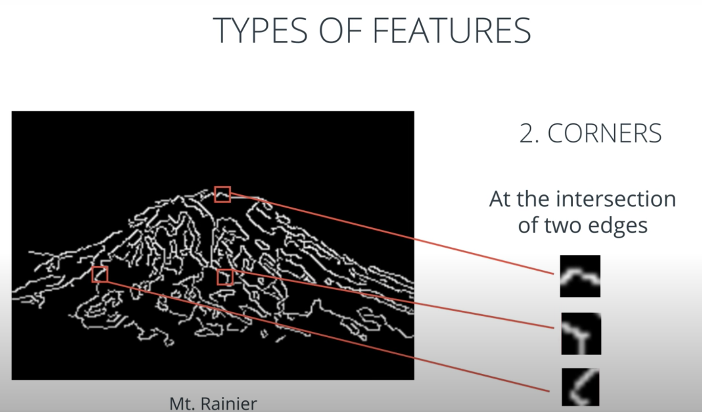
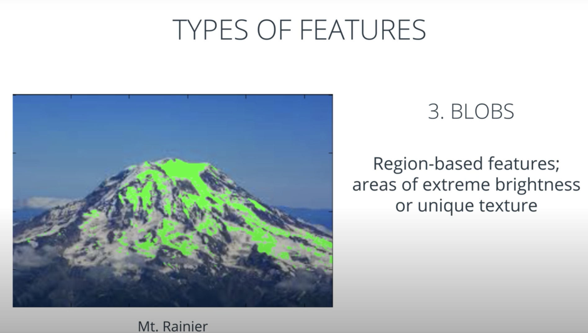
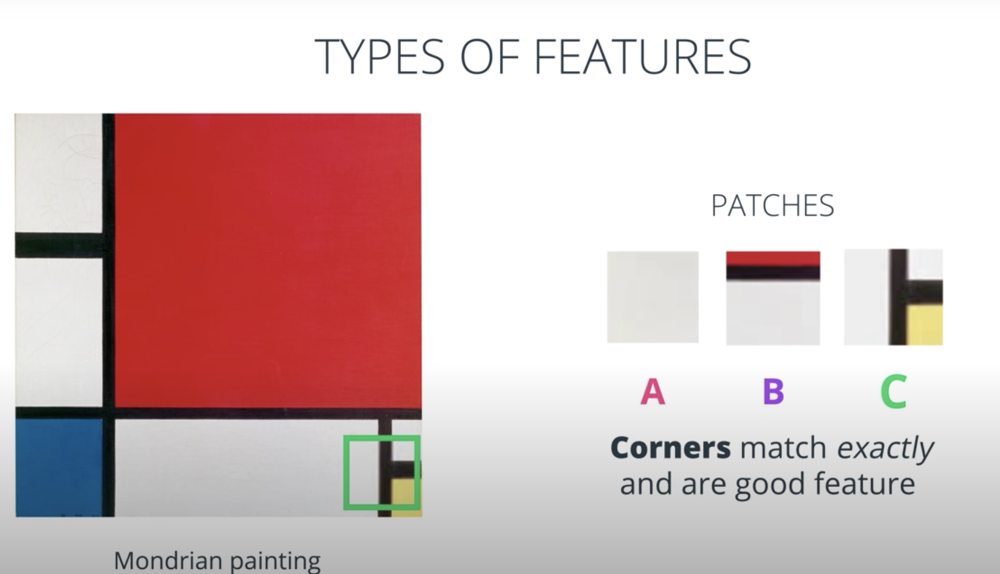
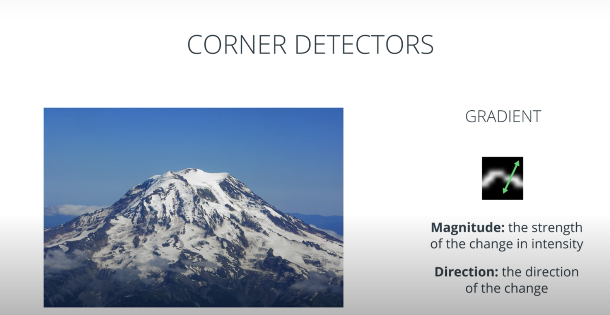
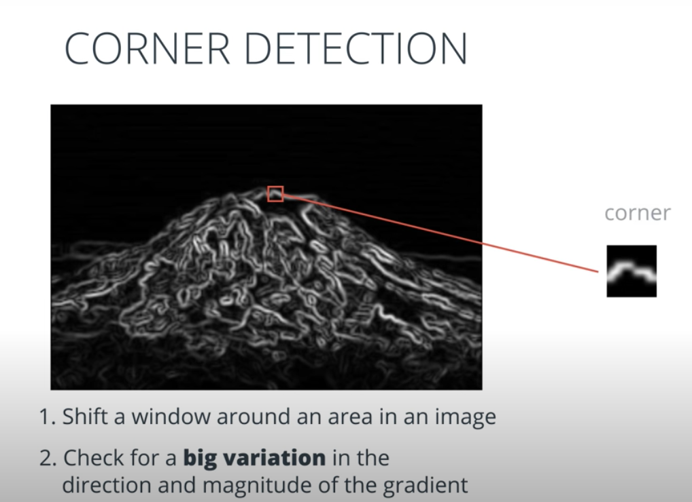

#### Notes

1. **Types of Features**
- Edges, Corners and Blobs
- Edges are detected using the change in intensity
- Corners are repeatable and are good features as they match exactly
- 
- 
- 
- 

2. A corner can be located by following these steps:
 - Calculate the gradient for a small window of the image, using sobel-x and sobel-y operators (without applying binary thesholding).
 - Use vector addition to calculate the magnitude and direction of the total gradient from these two values.
 - Apply this calculation as you slide the window across the image, calculating the gradient of each window. When a big variation in the direction & magnitude of the gradient has been detected - a corner has been found!
 - You can use Harris Corner Detection (OpenCV) for it.
 - 
 - 
