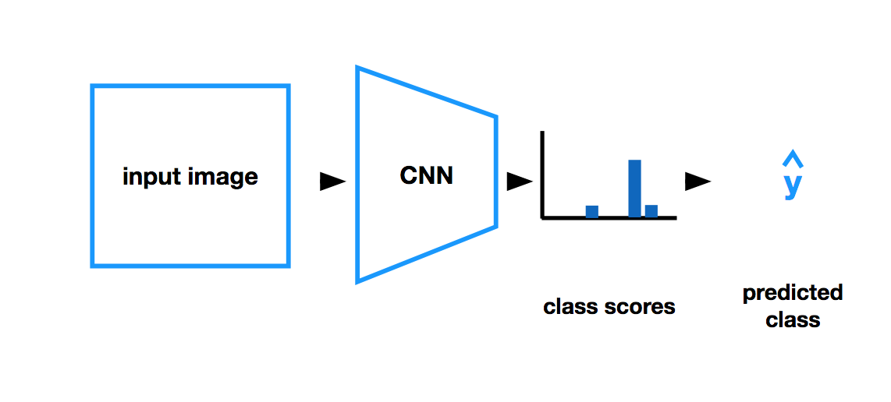
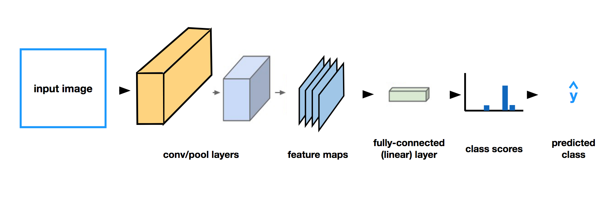

#### Notes

1. CNN network:
A classification CNN takes in an input image and outputs a distribution of class scores, from which we can find the most likely class for a given image.
- 
It comprises of layers that
- extracts the features from the input image
- reduces the dimensionality of the input image
- produces the class scores
- 

**NOTE**: Read this blog https://cezannec.github.io/Convolutional_Neural_Networks/
- Helpful to understand the different layers in the CNN network

2. [Fashion-MNIST](https://github.com/zalandoresearch/fashion-mnist): A dataset of images—consisting of a training set of 60,000 examples and a test set of 10,000 examples. Each example is a 28x28 grayscale image, associated with a label from 10 classes.

We will use this dataset in this CNN lesson.

Preprocessing steps used to create this dataset

3. Decoding CNN network: It is the type of deep neural network that is most powerful in image processing tasks, such as sorting images into groups, is called a Convolutional Neural Network (CNN).

- Convolutional Layer
  - The first layer in this network, that processes the input image directly, is a convolutional layer.
  - A convolutional layer takes in an image as input.
  - A convolutional layer, as its name suggests, is made of a set of convolutional filters (which you've already seen and programmed).
  - Each filter extracts a specific kind of feature, ex. a high-pass filter is often used to detect the edge of an object.
  - The output of a given convolutional layer is a set of **feature maps (also called activation maps)**, which are filtered versions of an original input image.

- Pooling Layer:
  - Pooling layers take in an image (usually a filtered image) and output a reduced version of that image
  - Pooling layers reduce the dimensionality of an input
  - Maxpooling layers look at areas in an input image (like the 4x4 pixel area pictured below) and choose to keep the maximum pixel value in that area, in a new, reduced-size area.
  - Maxpooling is the most common type of pooling layer in CNN's, but there are also other types such as average pooling.

- Fully-connected layer :
  - It's job is to connect the input it sees to a desired form of output.
  - Typically, this means converting a matrix of image features into a feature vector whose dimensions are 1xC, where C is the number of classes.

- Softmax function:
  - The softmax function, can take any vector of values as input and returns a vector of the same length whose values are all in the range (0, 1) and, together, these values will add up to 1.
  - This function is often seen in classification models that have to turn a feature vector into a probability distribution.

- Dropout Layer:
  - One of the most common layers to add to prevent overfitting is a dropout layer
  - Dropout layers essentially turn off certain nodes in a layer with some probability, p.
  - This ensures that all nodes get an equal chance to try and classify different images during training, and it reduces the likelihood that only a few, heavily-weighted nodes will dominate the process.

4. Other important points:
- The filters that detect edges are important feature maps in the convolutional neural networks
- Fundamentally, CNN and Feedforward networks are the same. Both have weights and baises. The difference lies in the fact that the nodes are connected to whole dataset in feedforward networks whereas the node in CNN is connected to a subset of data. Moreover, there is parameter sharing in the CNNs.
- Batch size affects the loss value

5. Normalization of Data:
- Normalization ensures that, as we go through a feedforward and then backpropagation step in training our CNN, that each image feature will fall within a similar range of values and not overly activate any particular layer in our network.
- During the feedfoward step, a network takes in an input image and multiplies each input pixel by some convolutional filter weights (and adds biases!), then it applies some activation and pooling functions.
- Without normalization, it's much more likely that the calculated gradients in the backpropagaton step will be quite large and cause our loss to increase instead of converge.

**LOT OF EXTRA_CURRICULAR TO GO THROUGH**
